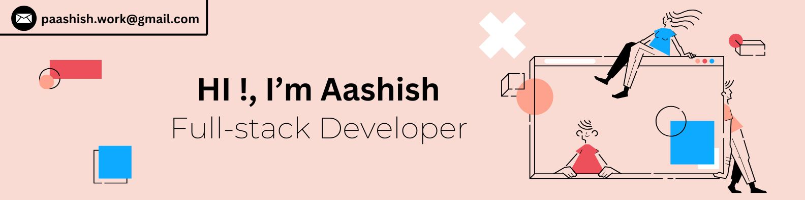

  

 

  
<h4>   About Me</h4>

I am a passionate Fullstack Developer with a strong foundation in both frontend and backend technologies. A versatile developer specializing in **Nextjs + Typescript, MERN Stack** with a passion for continuous learning. My expertise lies in integration, improving user interfaces, and enhancing overall user experiences. I thrive on solving challenging problems and creating innovative solutions.

<picture>
  <source media="(prefers-color-scheme: dark)" srcset="https://raw.githubusercontent.com/0xprasanth/0xprasanth/refs/heads/output/github-contribution-grid-snake-dark.svg">
  <source media="(prefers-color-scheme: light)" srcset="https://raw.githubusercontent.com/0xprasanth/0xprasanth/refs/heads/output/github-contribution-grid-snake.svg">
  
</picture>

  
<h4>  Coding Handles</h4>

  

  
<h4>  Tech Stack</h4>

  <h4>  Programming Languages</h4>
  

  <h2 >
     Stats
  </h2>

  <!-- GitHub Stats -->
  

  <!-- Top Languages -->
  

  <!-- GitHub Streak -->
  
  <!-- GitHub graph -->
  

  
